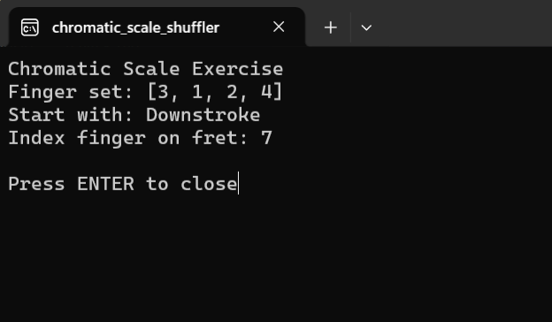

# Chromatic-Scale-Shuffler
The Chromatic Scale Shuffler keeps guitar warm ups interesting. Instead of playing 1-2-3-4 patterns every day, this tool gives you a shuffled order, random fret to start and stroke direction. This way you get a new challenge everytime and enhance your practice routine.

## chromatic_scale_shuffler.exe
This is the stand alone executable programm. If you just want to use the tool, you only need this.

## Python
This folder contains the source python script and requirements. The .exe file is build from the python script via pyinstaller. Pyinstaller will create some more data. For explanation visit: https://pyinstaller.org/en/stable/operating-mode.html#bundling-to-one-file